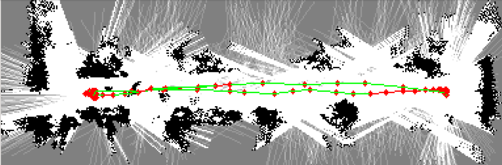

# FAQ Navigation 2.9

Please find below a medley of the frequently asked questions on Navigation with Pepper running NAOqi 2.9 found on the platform.

**If you want to have the best performances with navigation, it is needed to use Pepper 1.8 hardware version.**

The latest Naoqi version available is the 2.9.5 Release (2.9.5.172).

**POI** : Points of interest. The frames (locations) where Pepper can go.

**MapFrame** : origin of the map. This is the position of Pepper when you start the LocalizeAndMap action.

## Map creation

### What can I use to create a map and save Points of Interest (POI) in it?

You can use [Localization Setup app](https://qisdk.softbankrobotics.com/experimental/localization_setup_app.html) to handle the map / points of interest creation and saving. Then use [Localization library](https://qisdk.softbankrobotics.com/experimental/localization_library.html) to load them into your own application.

This application is available on [Command Center](https://command-center.softbankrobotics.com/store/).

You can also use the opensource app MapLocalizeAndMove available on our [GitHub](https://github.com/softbankrobotics-labs/maplocalizeandmove).

### What are best practices for preparing a "good" map?

**Pepper Hardware 1.8a** : Localisation works best when Pepper is close to the walls (not under 0.3m however, otherwise lasers can't see because of their minimum detection distance). 3 meters away is the limit. Angles and irregulatity help the robot to localize. (so, a corner is good, but a plain corridor isn't)

The lighting should not change too much from one time to another, and there should be no direct sunlight.

Note also that there should be no cycles in the map.

**Pepper Hardware 1.8** : Please refer to the article [Navigation using the qisdk](navigation_using_the_qisdk.md).

### Can maps have cycles?

**Pepper Hardware 1.8a** : No, the graph of points between pepper navigates should have a "star-shaped" or linear topology.

**Pepper Hardware 1.8** : Yes !

### Is there a way to have "automatic" exploration and Mapping?

No, not with QiSDK, but you could create a similar behavior yourself, or drive Pepper around with a gamepad.
You can also use Aruco markers, an example is available on our [GitHub](https://github.com/softbankrobotics-labs/pepper-aruco).

### How can I move Pepper around to create an exploration map?

You can manually push Pepper around (the person pushing Pepper should always stay behind it). You can also do some GoTo, or control pepper with a [gamepad](https://github.com/softbankrobotics-labs/pepper-gamepad).

### If I push Pepper around to create the map, will I be added to the map and degrade performance?

No, during post-processing obstacles, very near to Pepper will be removed to avoid this problem.
You still need to stay behind Pepper while pushing it (avoid to walk on the side of Pepper).

### What happens if when pushing a safety is triggered ? what if the robot gets on 2 wheel when pushing and gets back to its position? 

Open the Charging hatch to avoid this issue.

### Can a map be extended ?

Yes in Naoqi 2.9.5 on Pepper hardware version 1.8(stereo camera) with LocalizeAndMapBuilder.with(qiContext).withMap(previousExplorationMap).build()
The reference is [here](https://qisdk.softbankrobotics.com/sdk-beta/doc/pepper-sdk/ch4_api/movement/reference/localize_and_map.html#extend-an-existing-map).

### Can I have a display of the map during the mapping?

Yes it is possible with the news features that allow to extend a map (1.8 hardware only) and display it.
You can find the code in our QiSDK-tutorials on our [Github](https://github.com/aldebaran/qisdk-tutorials/blob/preview/app/src/main/java/com/softbankrobotics/qisdktutorials/ui/tutorials/motion/extendmap/MapExtensionTutorialActivity.kt).

### Can the map be iteratively improved if there are small changes in it?

No, you need to recreate a new map if the environment changed.

### Is there a limit in term of POI?

No, you can save as many POI as you want.

## Map management

### Is it possible to visualize the exploration map?

Yes in 2.9.5 (but the visualization of the map is only based on the lasers so if there is no obstacle around Pepper, the image of the map will be empty).

### Are .explo files made with NAOqi 2.5 reusable in QiSDK?

No.

### Can a map made with one Pepper be reused on another one?

It is possible to share maps between robots if they have the **same hardware version** and the **same Naoqi version**.

There is no dedicating API for that, your application should take care of the map and POI transfer.

### Can I modify Pepper's map on my computer?

It is not possible to modify Peppers map externally.

### Can I visualize Pepper's map on my computer?

If you build the image representing the map in your application (using [topGraphicalRepresentation](https://qisdk.softbankrobotics.com/sdk-beta/doc/pepper-sdk/ch4_api/movement/reference/exploration_map.html#displaying-a-map)), you can send it to a server or wherever you want.

### Can I modify Pepper's POI on my computer?

If you saved the POI in a readable format like Json yes.
Here is an example of POI saved by the app [MapLocalizeAndMove](https://github.com/softbankrobotics-labs/maplocalizeandmove) (since version 1.2.8, available on request on Partner Portal).
You can see the position x, y relatively to the mapFrame (origin) of the map and "theta", it's orientation relatively to the orientation of the mapFrame
<pre>
{
 "PointA":{"theta":1.4641932116152885,"x":2.5137854144601457,"y":-0.02701082234356411},
 "PointB":{"theta":-3.1220200640081384,"x":13.41486400625599,"y":0.17096083474293788},
 "PointC":{"theta":-1.5433353326594483,"x":5.925721525521025,"y":0.07953371720877822},
 "PointD":{"theta":1.4765085922543786,"x":10.882322814579709,"y":-0.05651157868420231},
 "PointE":{"theta":3.108248475788534,"x":8.703756237071868,"y":0.17012225890955968}
}
</pre>

### Is there a maximum size for the map?

There are no theoretical limits for the area covered by the map, but the file containing the serialized map itself cannot be more than 100 Mo if StreamableBuffer is used. 50 Mo otherwise.

When speaking about area / map size with Pepper, we speak about the length of the path that Pepper will navigate along (the path you take when pushing Pepper during LocalizeAndMap action).

On the representation of the map below, you can see the path in green.  

It is possible to map a path longer than 100m long.
The size of the file is not linearly linked to the length of the path. It also depends on the environment and the speed at which you are pushing Pepper during the mapping. 

Some example (in multiple environments) :

* Mapframe 360° only = 4 Mo.
* 19m = 8,8 Mo fast push.
* 55M = 16,4 Mo fast push.
* 30m = 12 Mo fast push.
* 80m = 19,5 Mo slow push.
* 30m = 55 Mo slow push + 360° turn on each POI.
* 65m = 23,4 Mo fast push + stop every 2 meters.
* 125m = 24 Mo fast push.
* 212m = 52 Mo slow push (half of the way was mapped only in one direction).

### What is the internal format of maps?

It's not part of the public API, as that may change with further sensor and software evolutions.

### What kind of information can I get from a map?

* It is possible to get the visualization of the map as a Bitmap.
* It is possible to calculate the size the area from the Bitmap or the POI.
* From the Visualization, you can see the empty space (white), the obstacles like walls and furnitures (black).

### Where is stored the map?

The map is stored in the tablet storage. It can be saved for use by Localize with dumpMap method. It can be serialized to save it to a file using StreamableBuffer.

**You can use Localization Setup app to handle the map / points of interest creation and saving. Then use Localization library to load them into your own application.**

## Moving around

### What is pepper's navigation speed?

Since 2.9.4 default speed is around 0.33 m/s (1.2 km/h)
And max speed is 0.55 m/s (2 km/h)

### Why does Pepper sometimes goes on a curvy trajectory and sometimes not, even though the environment is the same?

Could be a "ghost obstacle" (e.g. sunlight).

### Why does Pepper sometimes stop with no reason?

Could be a "ghost obstacle".

### Is there a way of detecting whether Pepper has exited the map?

There is no dedicated API, but you can keep track of Pepper's position (x,y) in your application.

### How is it possible to define an "allowed zone" out from which Pepper is not allowed to navigate?

Two kind of situation:
* the robot is given a destination outside the allowed zone you defined: to be handled application-side, check if the destination position (x,y) is inside the map before sending the robot (or prevent).
* robot goes to legitimate destination, but path-finding brings him outside the map : you could monitor the robot's position and cancel the move"

### Is it possible to define the path that Pepper has to follow to go to the targeted POI?

You cannot define the path itself, you will have to save intermediates POI and make Pepper go to them in the required order. 

### How does Pepper handle obstacles that were not present at map creation?

Pepper will go around them.

### How does Pepper handle obstacles that do not go all the way to the ground, such as hospital beds?

The lasers will not detect them, but the sonars can. However, the Sonar does not cover as wide an area as the lasers, so you should be careful if you have Pepper moving around such obstacles, as coming from the wrong angle could cause a collision. In general, avoid making pepper move in an area with mid-level obstacles, unless you have tested enough to be sure of Pepper's safety.

### How does Pepper handle glass walls?

The lasers will not detect them, but the sonars will, so Pepper will avoid them.

### How wide a passage / doorway can Pepper go through?

Around 1m10.

But in order to navigate smoothly in a corridor for example, it is better to have at least 2 metters.

## Navigation cues

### Can QR Codes or Aruco be used for localization?

There is no special treatment for that; though you could use them as a complement to localization (for example allowing you to do Localize.runWithHint().
An aruco example is available [here](https://github.com/softbankrobotics-labs/pepper-aruco).

## Sensors

### On which type of floor can Pepper Navigate?

Pepper needs a flat floor to navigate.
Pepper is using lasers to detect obstacles around it, so reflective floor can cause interferences with the lasers specifically if there are sunlight and sun-rays.

### Which sensors are used exactly for localization?

On **Pepper 1.8a hardware** :
 * Initial Localization: the top camera (2D) is used
 * Further localization: only the lasers and odometry are used
On **Pepper 1.8 hardware** :
 * Initial Localization: Stereo camera
 * Further localization: Stereo camera and odometry

### How are glass walls handled?

On Pepper 1.8a hardware :
For localization purposes, they will be ignored (treated as empty space).

They are detected as obstacles (by the sonar), but will not trigger a human detection because they are included in the map during mapping (""here's a place my sonars detected something even though my lasers didn't see it).

### What is the effect of ambient lighting?

During initial localization (unless a hint is used), Pepper will use images from the camera to estimate the current position; if the lighting has changed a lot, the Localize may fail.
On **Pepper 1.8 hardware** :  the robot uses its stereo cameras. They work as two smartphones cameras but in grayscale (no color). It does Visual SLAM, constant relocalization with image comparison. If the lighting has changed a lot between mapping time and Navigation time, the position of Pepper in its map could be wrong.

### What is the effect of sunlight?

Sunlight interferes with Pepper's lasers - for example, direct sunlight on the ground may be interpreted as a hole or an obstacle, and Pepper may avoid that area or stop moving.
