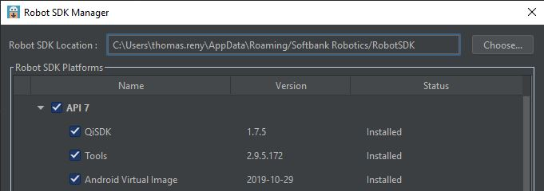
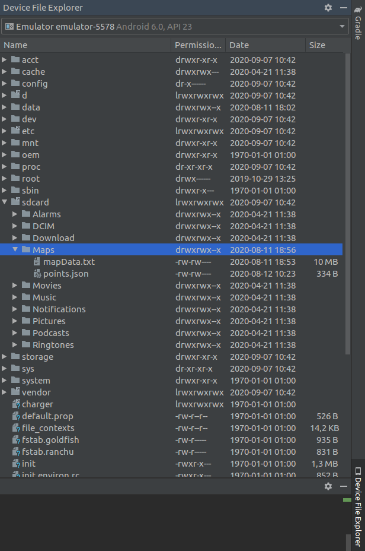

# Navigation tests in Emulator

During the development of your application including Navigation, some of you encountered the difficulty of testing the app without a real Pepper.

It is possible to use Navigation inside the Android Studio Emulator.

## Required Setup :

* Ubuntu 16.04 or Mac OS X 10.12+ (It will work on Windows but Pepper virtual robot won't move, "known issue Bug #43131":https://developer.softbankrobotics.com/pepper-qisdk/qisdk/known-issues) 
* Pepper SDK plugin version 1.5.3
* API 7 with the following versions :

## Use

1. Start the Emulator, when needed choose API 7.
2. Download [MapLocalizeAndMove Project](https://github.com/softbankrobotics-labs/maplocalizeandmove) and [Maps Folder](Maps.zip).
3. Open the MapLocalizeAndMove Project in Android Studio then install it on the Emulator.
4. Extract the Maps folder then upload it with the Device File Explorer of Android Studio on the Emulator sdcard as bellow :
Right click on sdcard then upload.

5. Launch MapLocalizeAndMove application, click **Production Mode**, then **Localize my robot**, then **Go To Frame**.
6. You can now perform GoTo action to the points of interest.
7. You can also create a Route, a sequence of ordered points of interest. Order them using the dropdown buttons on the left then click **GoTo Route**.

## Use your own Maps and Points of interest.

If you want to do your tests with your own Maps and Points of Interest (POI), you will have to install the application MapLocalizeAndMove on a real Pepper.
1. Do your map and save your Points of Interest on Pepper.
2. Connect Android Studio to your Pepper.
3. Use the Device File Explorer of Android Studio to save the folder /sdcard/Maps of your Pepper on your computer.
4. You can now start the Emulator and upload the Maps folder in /sdcard.
