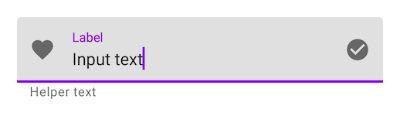

# Pepper & Material design

*Updated on April 20th 2020*

## Introduction

This file aims to present some useful components respecting Material Design’s principle and for which there are relevant use cases with Pepper. These are Android components provided by Google and allowing to improve the user experience on screen. Therefore, while user experience with Pepper should be robot interaction oriented, the tablet still exists and providing a good experience on screen is important.


## Get started

* Install Android Studio on you computer.

* In your Android Studio project, migrate to “AndroidX” (“Refactor / Migrate to AndroidX”).

* Add the following lines in your gradle :

*build.Gradle*
<pre><code class="gradle">
allprojects {
    repositories {
      google()
      jcenter()
    }
  }
</code></pre>
*app/build.Gradle*
<pre><code class="gradle">
dependencies {
    // ...
    implementation 'com.google.android.material:material:<version>'
    // ...
  }
</code></pre>

* The app must compile with at least Android 9 (SDK 28) :

*app/build.gradle*
<pre><code class="gradle">
android {
    compileSdkVersion 28
// ...
</code></pre>

* Each activity must inherit from AppCompatActivity (you can use RobotActivity since it inherit from AppCompatActivity).

* The app theme must inherit from one of the following themes :
** Theme.MaterialComponents 
** Theme.MaterialComponents.NoActionBar 
** Theme.MaterialComponents.Light 
** Theme.MaterialComponents.Light.NoActionBar 
** Theme.MaterialComponents.Light.DarkActionBar 
** Theme.MaterialComponents.DayNight 
** Theme.MaterialComponents.DayNight.NoActionBar 
** Theme.MaterialComponents.DayNight.DarkActionBar 
** Theme.MaterialComponents.Bridge 
** Theme.MaterialComponents.Light.Bridge 
** Theme.MaterialComponents.NoActionBar.Bridge 
** Theme.MaterialComponents.Light.NoActionBar.Bridge 
** Theme.MaterialComponents.Light.DarkActionBar.Bridge 

**res/values/styles.xml**
```xml
<style name="Theme.MyApp" parent="Theme.MaterialComponents.Light.NoActionBar">
    <!-- ... -->
</style>
```

More information are available on : https://github.com/material-components/material-components-android/blob/master/docs/getting-started.md

Once those steps are fulfilled, a lot of components are available. The most interesting ones are described below.

## Components

The full list of components is available on : https://material.io/components/
Most of those components are available not only on Android, but also on IOS, Flutter and Web. For each component, a general documentation is provided as well as a specific documentation for each technology.

### Text field

Documentation :

* https://material.io/components/text-fields/
* https://material.io/develop/android/components/text-fields/

#### Presentation

This is an improvement of EditText. Far more pleasant, it is provided with a special layout allowing to display a border and / or a background color, and also to trigger an animation with the text hint when the user clicks on it. A lot of other options are available, such as displaying a max number of characters, setting an error state, etc...


#### Use case

You may need to ask the user’s name or email address with Pepper. In that case, the chat may not be enough to catch the correct input. Adding the text field to add a manual input option is a good idea.

#### Examples

Adding a text field is quite simple. It is compounded with two items : a TextInputLayout and a TextInputEditText within. Most features are provided by the TextInputLayout. Be careful : the hint attribute must be indicated within the TextInputLayout instead of TextInputEditText.

##### Example 1

The first example corresponds to the style by default. The hint color, background color and stroke color are editable :


**Layout**

```xml
<com.google.android.material.textfield.TextInputLayout
    android:layout_width="match_parent"
    android:layout_height="wrap_content"
    android:hint="@string/label"
    app:hintTextColor="@color/colorHint"
    app:boxBackgroundColor="@color/colorBackground"
    app:boxStrokeColor="@color/colorStroke">

    <com.google.android.material.textfield.TextInputEditText
        android:layout_width="match_parent"
        android:layout_height="wrap_content"
    />

</com.google.android.material.textfield.TextInputLayout>
```

##### Example 2

The second example can be created by simply specifying an outline style :


**Layout**
```xml
<com.google.android.material.textfield.TextInputLayout
    style="@style/Widget.MaterialComponents.TextInputLayout.OutlinedBox"
    android:layout_width="match_parent"
    android:layout_height="wrap_content"
    android:hint="@string/label"
    app:hintTextColor="@color/colorHint"
    app:boxStrokeColor="@color/colorStroke">

    <com.google.android.material.textfield.TextInputEditText
        android:layout_width="match_parent"
        android:layout_height="wrap_content"
    />

</com.google.android.material.textfield.TextInputLayout>
```

##### Go further

A lot of interesting features are provided in the TextInputLayout, for instance :

* Add an icon


```xml
app:startIconDrawable="@drawable/ic_favorite_24dp"
```

* Add an helper text, giving some info about the field (you can for instance specify that the field is mandatory)



```xml
app:helperTextEnabled="true"
app:helperText="@string/helper_text"
```

* Add a counter to count the number of characters


```xml
app:counterEnabled="true"
app:counterMaxLength="20"
```

* Add an error state, activated when the user input is not correct (for example when the user tries to validate a form and a mandatory field is empty) :


```xml
app:errorEnabled="true"
```

In your code, specifying the rules to activate and clear the error state is up to you. You can specify any rule you want and any error text you want.

**Code (Kotlin)**
<pre><code class="kotlin">
// Activate error status and set an error text
textInputLayout.error = getString(R.string.error)

// Clear error status
textInputLayout.error = null
</code></pre>

**Code (Java)**
<pre><code class="java">
// Activate error status and set an error text
textInputLayout.error = getString(R.string.error)

// Clear error status
textInputLayout.setError (null);
</code></pre>

* More features are available on the documentation.

##### Go further with a drop down menu

The text field can also expand a drop down menu :


A drop down menu can be created by wrapping an AutoCompleteTextView within a TextInputLayout, and by adding an ExposedDropdownMenu style to the TextInputLayout. This style can be combined with any of the TextInputLayout styles : FilledBox or OutlinedBox :

**Layout**
```xml
<com.google.android.material.textfield.TextInputLayout
    style="@style/Widget.MaterialComponents.TextInputLayout.FilledBox.ExposedDropdownMenu"
    android:layout_width="match_parent"
    android:layout_height="wrap_content"
    android:hint="@string/label">

    <AutoCompleteTextView
        android:layout_width="match_parent"
        android:layout_height="wrap_content"
        android:inputType="none"
    />

</com.google.android.material.textfield.TextInputLayout>
```

You also need to provide a layout to display each item in the list. This layout may contain just a simple TextView to show the item :

**res/layout/list_item**
```xml
<TextView
    xmlns:android="http://schemas.android.com/apk/res/android"
    android:layout_width="match_parent"
    android:layout_height="wrap_content"
    android:padding="8dp"
    android:ellipsize="end"
    android:maxLines="1" />
```

Then an adapter must be provided to the AutoCompleteTextView to get the list of menu items. The item layout must also be provided to the adapter in order to display each item in the list.

**Code (Kotlin)**
<pre><code class="kotlin">
val items = listOf("Material", "Design", "Components", "Android")
val adapter = ArrayAdapter(context, R.layout.list_item, items)
autoCompleteTextView?.setAdapter(adapter)
</code></pre>

**Code (Java)**
<pre><code class="java">
String[] items = {"Material", "Design", "Components", "Android"};
ArrayAdapter adapter= new ArrayAdapter(context, R.layout.list_item, items);
autoCompleteTextView.setAdapter(adapter);
</code></pre>

### Button

Documentation :
https://material.io/components/buttons/
https://material.io/develop/android/components/buttons/

#### Presentation

This evolution of the simple “Button” gives adding possibilities to monitor its design. With this advanced button it is possible to set corner radius, elevation, etc...


#### use case

During a chat, Pepper often asks something to the human, who has a given choice of answers. A good practice is to use Buttons to display the list of possible answers that the human can say, adding the option to simply click on the button.

#### Examples

##### Example 1

You need to use a MaterialButton with a TextButtonStyle to create the first example :


**Layout**
```xml
<com.google.android.material.button.MaterialButton
    style="@style/Widget.MaterialComponents.Button.TextButton"
    android:layout_width="match_parent"
    android:layout_height="wrap_content"
    android:layout_margin="16dp"
    android:text="@string/text"
    android:textColor="@color/colorText"/>
```

##### Example 2

An outline style allows to create an outline button without elevation, usually relevant to provide a “cancel” or a “back” action. The stroke color and width are editable :


**Layout**
```xml
<com.google.android.material.button.MaterialButton
    style="@style/Widget.MaterialComponents.Button.OutlinedButton"
    android:layout_width="match_parent"
    android:layout_height="wrap_content"
    android:layout_margin="16dp"
    android:text="@string/text"
    android:textColor="@color/colorText"
    app:strokeColor="@color/colorStroke" />
```

##### Example 3

This example corresponds to the style by default, with an elevation and a background color. This kind of button is usually relevant to provide a validation action :


**Layout**
```xml
<com.google.android.material.button.MaterialButton
    android:layout_width="match_parent"
    android:layout_height="wrap_content"
    android:layout_margin="16dp"
    android:text="@string/text"
    android:textColor="@color/colorText"
    app:backgroundTint="@color/colorBackground"/>
```

##### Go further

A lot of other features are available, for instance :

* Set an icon

```xml
app:icon="@drawable/ic_add_24dp"
```

* Change the corner radius

```xml
app:cornerRadius="20dp"
```

* Change the elevation

```xml
app:elevation="8dp"
```

* A lot of other features are available on the documentation.

##### 3.2.3.5 Example 4 : Go further with the Toggle Button

A Toggle button provides a choice between two or more buttons. It is useful to select filters for example. This can be created by wrapping MaterialButtons within a MaterialButtonToggleGroup. The example 4 shows this example with icon buttons :


First of all, you need to create a style for Icon only buttons :

**Styles**
```xml
<style name="Widget.App.Button.OutlinedButton.IconOnly" parent="Widget.MaterialComponents.Button.OutlinedButton">
    <item name="iconPadding">0dp</item>
    <item name="android:insetTop">0dp</item>
    <item name="android:insetBottom">0dp</item>
    <item name="android:paddingLeft">12dp</item>
    <item name="android:paddingRight">12dp</item>
    <item name="android:minWidth">48dp</item>
    <item name="android:minHeight">48dp</item>
</style>
```

Then you can create the ToggleButton in your layout :

**Layout**
```xml
<com.google.android.material.button.MaterialButtonToggleGroup
    android:layout_width="wrap_content"
    android:layout_height="wrap_content"
    android:layout_margin="16dp"
    app:singleSelection="true"
    app:checkedButton="@id/button_1">
    <com.google.android.material.button.MaterialButton
        android:id="@+id/button_1"
        style="@style/Widget.App.Button.OutlinedButton.IconOnly"
        android:layout_width="wrap_content"
        android:layout_height="wrap_content"
        app:icon="@drawable/icon1" />
    <com.google.android.material.button.MaterialButton
        android:id="@+id/button_2"
        style="@style/Widget.App.Button.OutlinedButton.IconOnly"
        android:layout_width="wrap_content"
        android:layout_height="wrap_content"
        app:icon="@drawable/icon2" />
    <com.google.android.material.button.MaterialButton
        android:id="@+id/button_3"
        style="@style/Widget.App.Button.OutlinedButton.IconOnly"
        android:layout_width="wrap_content"
        android:layout_height="wrap_content"
        app:icon="@drawable/icon3" />
</com.google.android.material.button.MaterialButtonToggleGroup>
```

You can catch any selection change in your code with the listener :

**Code (Kotlin)**
<pre><code class="kotlin">
toggleButton.addOnButtonCheckedListener { toggleButton, checkedId, isChecked ->
    // Respond to button selection
}
</code></pre>

**Code (Java)**
<pre><code class="java">
toggleButton.addOnButtonCheckedListener((group, checkedId, isChecked) -> {
    // Respond to button selection
});
</code></pre>

### Card

Documentation :
https://material.io/components/cards/#usage
https://material.io/develop/android/components/cards/

#### Presentation

Cards are useful to display a set of information about an object within a beautiful shape. A lot of options are available to monitor the design : it is easily possible to set the background color, the corners, the elevation…


#### Use case

Cards are useful when a set of information about an object must be displayed, especially when a group of objects are shown, each one with several information (for instance : a list of meals to order in a restaurant, with a name, a price and a photo for each one). Pepper cannot say the full list to the human, so showing the list within cards and let the human see it is a good option.

#### Example

A Card works like a FrameLayout. Any view can be added inside :

**Layout**
```xml
<com.google.android.material.card.MaterialCardView
    android:id="@+id/card"
    android:layout_width="match_parent"
    android:layout_height="wrap_content"
    android:layout_margin="8dp">

    <LinearLayout
        android:layout_width="match_parent"
        android:layout_height="wrap_content"
        android:orientation="vertical">

        <ImageView
            android:layout_width="match_parent"
            android:layout_height="194dp"
            app:srcCompat="@drawable/media"
            android:scaleType="centerCrop"
            android:contentDescription="@string/content_description_media"
            />

        <TextView
            android:layout_width="wrap_content"
            android:layout_height="wrap_content"
            android:text="@string/text"/>

        <com.google.android.material.button.MaterialButton
            android:layout_width="wrap_content"
            android:layout_height="wrap_content"
            android:text="@string/buttonText"/>
…
```
It is then possible to :

* Change the elevation

```xml
app:cardElevation="4dp"
```

* Change the stroke color or width

```xml
app:strokeColor="@color/stroke_color"
app:strokeWidth="2dp"
```

* Change the corners, the ripple color… A lot of other features are available on the documentation.

### Bottom sheet

Documentation :
https://material.io/components/sheets-bottom/#usage
https://material.io/develop/android/components/bottom-sheet-behavior/

#### Presentation

A Bottom sheet aims to display additional contents expanding from the bottom of the screen. It is triggered by a given user action.


#### Use case

When the screen is already busy, a Bottom sheet may be useful to display extra information after a given action from the user (for example : when the human is ordering meals at the restaurant and wants to see the order without leaving the menu screen, then asking Pepper to show the order would expand a bottom sheet containing the list of ordered articles and their prices).

#### Example

Any view can be turned to a Bottom sheet. You need to :
* Wrap the view within a CoordinatorLayout.
* Indicate that the view has a Bottom sheet behavior.
* Eventually specify if the bottom sheet can be hidden and add other options.

**Layout**
```xml
<androidx.coordinatorlayout.widget.CoordinatorLayout>

...

    <com.google.android.material.card.MaterialCardView
        android:id="@+id/bottom_sheet"
        android:layout_width="match_parent"
        android:layout_height="wrap_content"
        app:layout_behavior="com.google.android.material.bottomsheet.BottomSheetBehavior"
        app:behavior_hideable="true">

        <com.google.android.material.button.MaterialButton
            android:layout_width="wrap_content"
            android:layout_height="wrap_content"
            android:text="@string/buttonText1"/>

        <com.google.android.material.button.MaterialButton
            android:layout_width="wrap_content"
            android:layout_height="wrap_content"
            android:text="@string/buttonText2"/>

    </com.google.android.material.card.MaterialCardView>

</androidx.coordinatorlayout.widget.CoordinatorLayout>
```

In your code you can get the bottom sheet with :

**Code (Kotlin)**
<pre><code class="kotlin">
val bottomSheet =  BottomSheetBehavior.from(bottom_sheet)
</code></pre>

**Code (Java)**
<pre><code class="java">
BottomSheetBehavior bottomSheet=BottomSheetBehavior.from(bottom_sheet);
</code></pre>

Once a Bottom sheet is created, you can monitor it and set its state, for example :

* Hidden : The bottom sheet is not visible

**Code (Kotlin or Java)**
<pre><code class="java">
bottomSheet.setState(BottomSheetBehavior.STATE_HIDDEN);
</code></pre>

* Collapsed : The bottom sheet only shows its peek height

**Code (Kotlin or Java)**
<pre><code class="java">
bottomSheet.setState(BottomSheetBehavior.STATE_COLLAPSED);
</code></pre>

* Expanded : The full bottom sheet is shown

**Code (Kotlin or Java)**
<pre><code class="java">
bottomSheet.setState(BottomSheetBehavior.STATE_EXPANDED);
</code></pre>

You also can set the peek height :

**Code (Kotlin or Java)**
<pre><code class="java">
bottomSheet.setPeekHeight(300);
</code></pre>

### Chip

Documentation :
https://material.io/components/chips/
https://material.io/develop/android/components/chip/

#### Presentation

Chips are a proper way to display a list of short items for which the user can interact with. It is commonly used to offer filter or sort options.


#### Use case

Let’s imagine that Pepper shows a menu with a list of meals to order in a restaurant. The human may want to display only vegetarian meal, or vegan, or gluten free. These filter options may be displayed with chips to let the human chose between speaking to Pepper or manually select a filter.

#### Example

A chip can be displayed individually or be a part of a chip group.

**Layout**
```xml
<com.google.android.material.chip.ChipGroup
    android:layout_width="match_parent"
    android:layout_height="wrap_content">

    <com.google.android.material.chip.Chip
        style="@style/Widget.MaterialComponents.Chip.Filter"
        android:layout_width="wrap_content"
        android:layout_height="wrap_content"
        android:text="@string/vegetarian"/>

    <com.google.android.material.chip.Chip
        style="@style/Widget.MaterialComponents.Chip.Filter"
        android:layout_width="wrap_content"
        android:layout_height="wrap_content"
        android:text="@string/vegan"/>

</com.google.android.material.chip.ChipGroup>
```

Many options can be set in the ChipGroup, for example :

* Specify that one single selection is possible

```xml
app:singleSelection="true"
```

* Specify that the list of chips should appear on one single line

```xml
app:singleLine="true"
```

In the code, it is possible to handle the selection change.

**Code (Kotlin)**
<pre><code class="kotlin">
chipGroup.setOnCheckedChangeListener { group, checkedId -> {
        // Handle the checked chip change.
    }
})
</code></pre>

**Code (Java)**
<pre><code class="java">
chipGroup.setOnCheckedChangeListener((group, checkedId) -> {
        // Handle the checked chip change.
    }
);
</code></pre>

And of course, many options can be set within a Chip : set the background, the stroke, the icon… More details are available on the documentation.